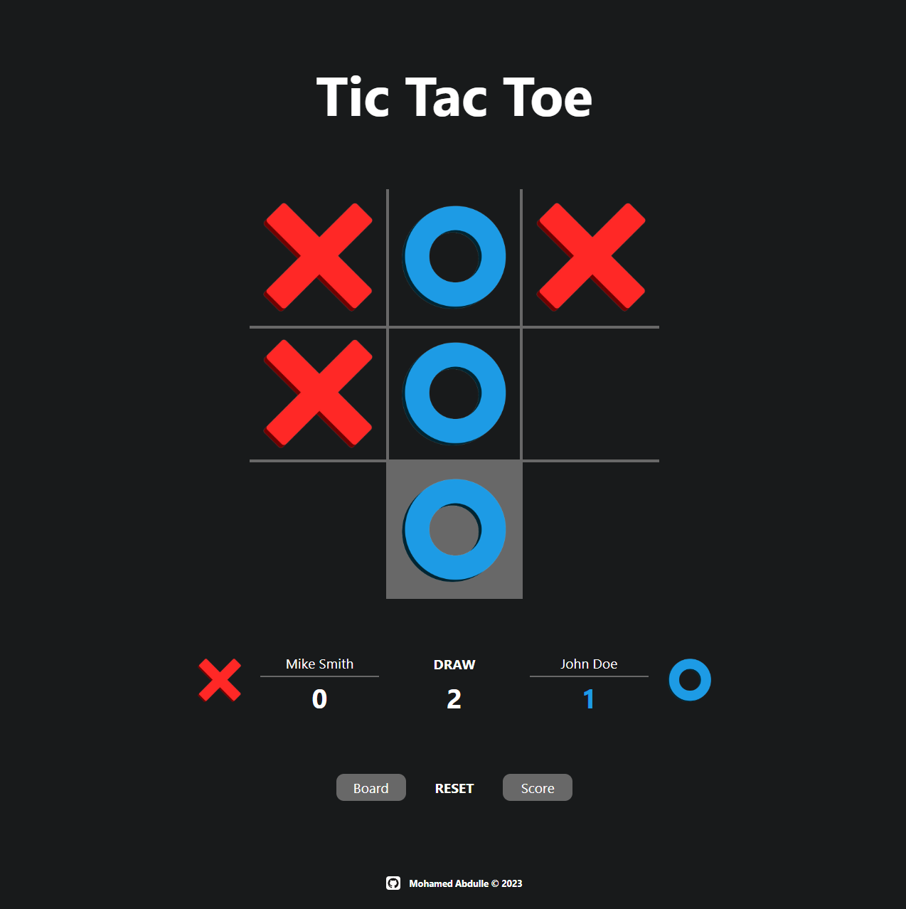
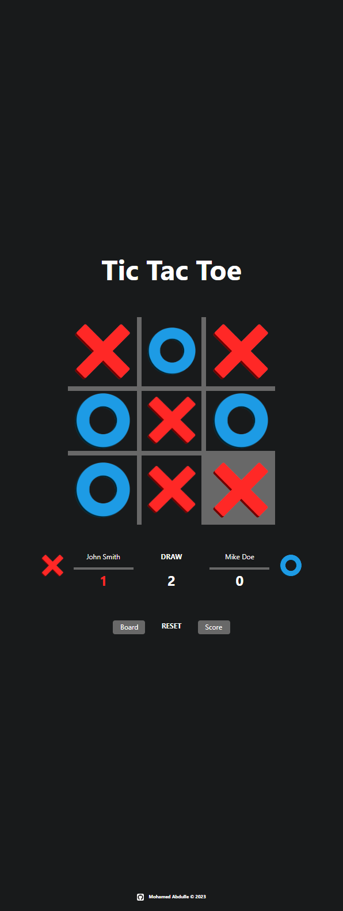

# Tic Tac Toe

This is a 2-player Tic Tac Toe game.
- The board is a 3 X 3 grid.
- There is a scoreboard that records the scores, including draws.
- There are two reset buttons.
  - The left button resets the board, while the right button resets the scores.

### Full View:

### Mobile View:

## Links
- [Click here to see the Tic Tac Toe game.](https://mohamedabdulle.github.io/tic-tac-toe/)

- [Link to the assignment details.](https://www.theodinproject.com/lessons/node-path-javascript-tic-tac-toe)

## Description

The purpose of this project was to practise the use of:
- Factory functions
- Module pattern
- Scopes
- Closures
- Private variables and functions 